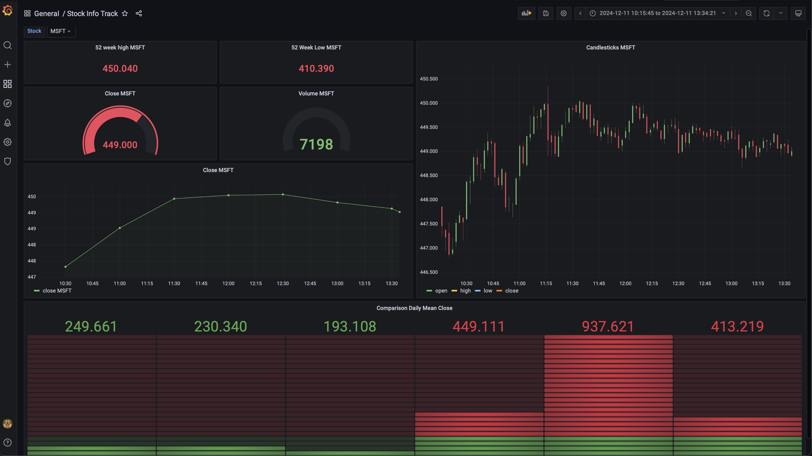
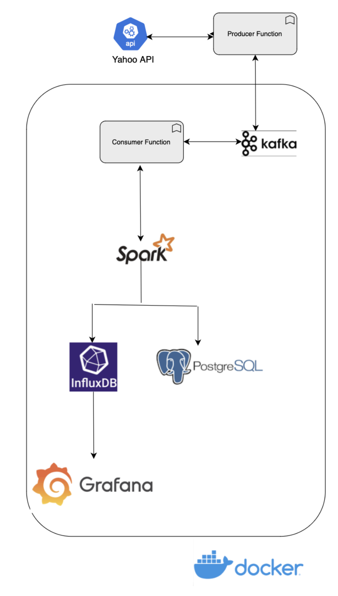

# StockStream - Real Time Stock Insights

## Overview

This project, **StockStream**, is designed to retrieve real-time stock data, perform streaming data analysis using Apache Kafka and Apache Spark, store data in InfluxDB, and visualize the data with Grafana. It provides valuable insights into the stock market and allows users to monitor stock prices effectively. General information regarding stocks is also retrieved and stored in a PostgreSQL database.

## Table of Contents

- [Commands to Run the Project](#commands-to-run-the-project)
- [Project Structure](#project-structure)
- [Project Components](#project-components)
- [Data Flow](#data-flow)
- [Dashboard Preview](#dashboard-preview)
- [Project Architecture](#project-architecture)
- [Configuration](#configuration)
- [Contributing](#contributing)

## Commands to Run the Project

Before running the project, ensure you have the following tools installed and configured on your system:

- **Python**: Version 3.10.16
- **Pip**: Version 23.0.1
- **Docker**: Version 25.0.3
- **Docker Compose**: Included in Docker 25.0.3
- **Kafka, Spark, InfluxDB, and Grafana**: Docker images will be automatically pulled by the Docker Compose file.

Follow the steps below to set up and run the project:

1. **Start Docker Containers**:
   Inside the parent directory, run:
   ```bash
   docker-compose up -d
   ```

2. **Install Python Dependencies**:
   Install the required Python packages:
   ```bash
   pip install -r requirements.txt
   ```

3. **Run the Producer**:
   Navigate to the producer directory and start the producer script:
   ```bash
   cd producer
   python producer.py
   ```

4. **Run the Consumer with Spark**:
   Open a new terminal, navigate to the project root directory, and execute the following command to run the consumer script with Spark:
   ```bash
   docker exec -it ktech_spark_submit bash -c "spark-submit --master spark://spark-master:7077 \
       --packages org.apache.spark:spark-sql-kafka-0-10_2.12:3.3.3 \
       --jars /opt/bitnami/spark/jars/postgresql-42.5.4.jar \
       /app/consumer/consumer.py"
   ```

By following these steps, you can fully set up and run the project in a containerized environment.

## Project Structure

The project structure is organized as follows, highlighting the code flow:
```
├── producer/
│   ├── producer.py            # Main producer script for stock data
│   ├── producer_utils.py      # Helper functions for producer operations
│   ├── stock_info_producer.py # Produces stock metadata and sends to Kafka or PostgreSQL
│
├── consumer/
│   ├── consumer.py            # Spark Streaming consumer for processing Kafka data
│   ├── InfluxDBWriter.py      # Writes transformed data to InfluxDB
│
├── logs/                      # Log files generated by the application
│   ├── producer.log           # Logs for producer operations
│   ├── consumer.log           # Logs for consumer operations
│
├── docker-compose.yml         # Docker Compose configuration file
├── .env                       # Environment variables for the project
├── README.md                  # Project documentation (this file)
```

## Project Components

1. **Apache Kafka**: 
   Kafka serves as the backbone for data streaming. It manages the flow of real-time stock data between producers and consumers, ensuring fault tolerance and scalability.

2. **Producers**: 
   Producers fetch and format stock data using APIs like yfinance. The formatted data is sent to Kafka for distribution.

3. **Spark Streaming (Kafka Consumer)**: 
   Spark processes the data received from Kafka in real time, transforming it into meaningful insights like moving averages and trends.

4. **InfluxDB**: 
   InfluxDB is a time-series database that stores the processed stock data, making it available for visualization and analysis.

5. **PostgreSQL**: 
   PostgreSQL manages structured data like stock metadata, providing robust relational storage for static queries.

6. **Grafana**: 
   Grafana visualizes the data stored in InfluxDB through interactive dashboards, enabling real-time monitoring and decision-making.

## Data Flow

1. **Data Collection**:
   - Producers fetch stock data using the yfinance library.
   - Two types of data:
     - Real-Time Stock Prices: Sent to `real-time-stock-prices` Kafka topic.
     - Stock Metadata: Sent to `stock-general-information` Kafka topic or PostgreSQL.

2. **Data Streaming**:
   - Apache Kafka acts as the central hub for streaming data between producers and consumers.

3. **Real-Time Processing**:
   - Spark Structured Streaming consumes data from Kafka topics.
   - Data is parsed, validated, and transformed into meaningful metrics (e.g., moving averages).

4. **Data Storage**:
   - Time-series data is written to InfluxDB.
   - Structured metadata is stored in PostgreSQL.

5. **Visualization**:
   - Grafana reads time-series data from InfluxDB and provides interactive dashboards.

## Dashboard Preview

The real-time stock monitoring dashboard provides a comprehensive view of stock prices, trends, and aggregated metrics. Below is a preview:





This dashboard allows users to track real-time stock price changes, analyze trends, and make informed decisions.

## Project Architecture

The architecture of this project integrates multiple components to ensure efficient real-time data streaming, processing, storage, and visualization. Below is the architecture diagram:





### Key Highlights:
- Producers fetch data from APIs and publish to Kafka topics.
- Kafka serves as the message broker, decoupling producers and consumers.
- Spark processes data in real time and sends it to InfluxDB and PostgreSQL.
- Grafana visualizes the data stored in InfluxDB for monitoring.

## Configuration

- Configuration for various services, such as Kafka, Spark, InfluxDB, and Grafana, can be found in the `docker-compose.yml` file.
- Environment variables can be configured in the `.env` file.

